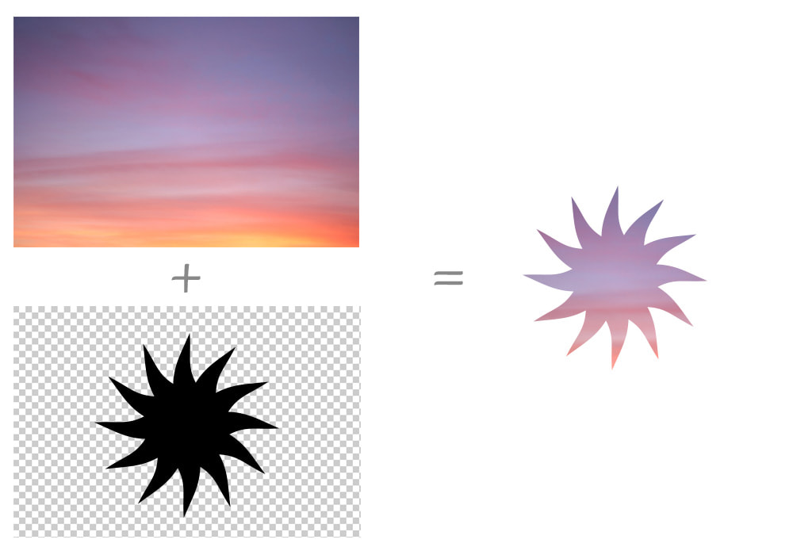

## What is CSS Masking?

CSS Masking is a technique that allows you to hide or show parts of an element by using an image or gradient as a mask. It works similarly to mask layers in graphics programs.

---

```css
.mask {
    mask-image: url(mask.png);
    mask-repeat: no-repeat;
    mask-size: cover;
    mask-position: center;
}
```

output
