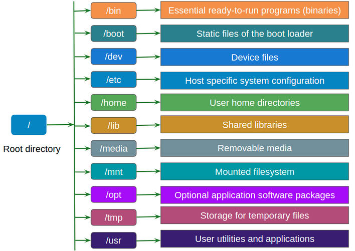

# Linux File System

The Linux file system is organized in a hierarchical tree structure, starting from the **root** (indicated by `/`). Each element (file, directory, device) is accessible starting from this root.

---

### **`/` (Root)**
- It is the root directory, from which all the others start.
- Contains all the files and directories of the system.

### **`/bin` (Essential Binaries)**
- Contains the **essential commands** for the system (e.g. `ls`, `cp`, `mv`, `bash`).
- They can be run by all users.

### **`/sbin` (System Binaries)**
- Contains **system administration** programs (e.g. `fdisk`, `ifconfig`, `iptables`).
- Usually requires **root** permissions.

### **`/boot` (Boot Files)**
- Contains the **kernel**, bootloader files (`grub`) and files needed for booting.

### **`/dev` (Devices)**
- Contains special files representing **hardware devices** (e.g. `/dev/sda` for disk, `/dev/tty` for consoles).
- In Linux, everything is a file, even hardware.

### **`/etc` (System Configurations)**
- Contains global **configuration files** (e.g. `/etc/passwd`, `/etc/fstab`, `/etc/network/interfaces`).
- Editing these files usually requires root permissions.

### **`/home` (User Directory)**
- Each user has their own directory (e.g. `/home/mario`) where they can save personal files.
- This is the default working directory for non-root users.

### **`/lib` and `/lib64` (Essential Libraries)**
- These contain **shared libraries** needed by programs in `/bin` and `/sbin`.
- `/lib64` is used for 64-bit libraries.

### **`/media` and `/mnt` (Mount Points)**
- `/media`: used for automatic mounting of removable devices (e.g. USB, CD-ROM).
- `/mnt`: used for manual temporary mounting (e.g. network partitions or additional disks).

### **`/opt` (Additional Software)**
- Used for manually installed third-party programs (e.g. Google Chrome, Oracle).

### **`/proc` (Kernel Virtual File System)**
- Contains real-time **process and system** information (e.g. `/proc/cpuinfo`, `/proc/meminfo`).
- Does not take up disk space, dynamically generated by the kernel.

### **`/root` (Administrator Home)**
- Home directory of the **root** user (different from `/home/root`).

### **`/run` (Temporary Runtime Data)**
- Stores volatile information about running processes (PID, socket, lock).
- Partially replaces `/var/run` on modern systems.

### **`/srv` (Service Data)**
- Contains data related to network services (e.g. FTP, HTTP).

### **`/tmp` (Temporary Files)**
- Temporary files deleted on reboot (sometimes mounted in RAM with `tmpfs`).

### **`/usr` (User Programs and Libraries)**
- Contains most **installed programs** and libraries.
- `/usr/bin`: User commands.
- `/usr/sbin`: Non-essential administrative commands.
- `/usr/lib`: Libraries for programs in `/usr`.
- `/usr/local`: Manually compiled software (not by the package manager).

### **`/var` (Variable Files)**
- Contains data that is constantly changing:
- `/var/log`: Log files.
- `/var/cache`: Application cache.
- `/var/spool`: Print queues, email.
- `/var/www`: Website files (if using Apache/Nginx).