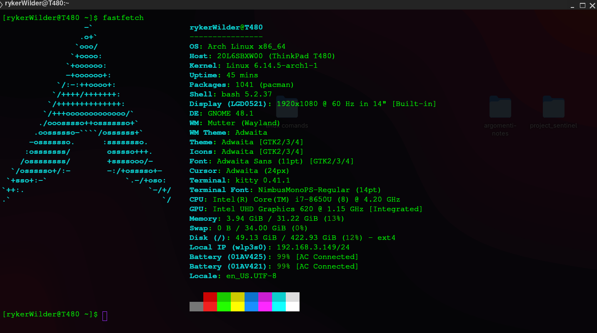

# Kitty 
is a versatile, snappy GPU-powered terminal emulator for Linux. It’s highly customizable and an excellent alternative for those on Linux who are not happy with the stock terminal apps that come with popular desktop environments. In this guide, we’ll show you how to install Kitty and customize it too. 



The Kitty emulator is widely available to all Linux users. From Ubuntu to OpenSUSE, you’ll be able to get Kitty set up and installed without any issues. To start the installation process on your Linux computer, launch a terminal window.
Once the terminal window is open and ready to use, follow along with the command-line installation instructions outlined below that corresponds with the Linux operating system you currently use.

### How to install kitty
this command is only for archlinux. You can find all the others commands on documentation. [kitty-documentation]('https://sw.kovidgoyal.net/kitty/binary/#')
```bash
sudo pacman -S kitty
```

### Customization
The Kitty terminal emulator’s customization is done through a configuration file, rather than a built-in UI like other terminal apps on Linux. As a result, you have much more control. In this section, we’ll go over some very basic customization options you can do.

To start the customization, you will need to create a new configuration file for your user. Keep in mind that this configuration file will need to exist for each user who wants to customize Kitty’s look.

```bash
mkdir -p ~/.config/kitty/
```

```bash
nano ~/.config/kitty/kitty.conf
```

Now you can customize kitty with a lot of paramaters. This is an example of kitty.conf

```
# Graphics/Performance
opengl_backend auto
sync_to_monitor no
repaint_delay 10
input_delay 3
background_blur 0

# Font
font_size 14

#Theme
foreground #00ff00
background #000000
background_opacity 0.6

# Cursor
cursor #9b30ff

disable_ligatures never

# Window
hide_window_decorations titlebar-only
background_opacity 0.85
dynamic_background_opacity yes
window_padding_width 6
confirm_os_window_close 0

# Bells
enable_audio_bell no
visual_bell_duration 0

# Essentials
copy_on_select yes
strip_trailing_spaces smart
scrollback_lines 5000

# Keybinds (minimal)
map ctrl+shift+c copy_to_clipboard
map ctrl+shift+v paste_from_clipboard
map ctrl+equal change_font_size all +1.0
map ctrl+minus change_font_size all -1.0

shell_integration no-rc
startup_message enabled
```
