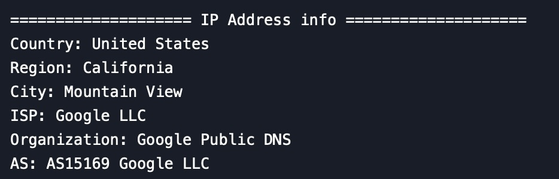

# IP Information Lookup Tool 
A simple Python script to fetch geolocation and network information for any IP address using the IP-API service.

---

```python
import requests
def get_ip_info(ip_address):
    try:
        response = requests.get(f"http://ip-api.com/json/{ip_address}")
        data = response.json()
        
        if data['status'] == 'success':
            print("\n" + "="*20 + " IP Adress info " + "="*20)
            print(f"Country: {data.get('country', 'N/A')}")
            print(f"Region: {data.get('regionName', 'N/A')}")
            print(f"City: {data.get('city', 'N/A')}")
            print(f"ISP: {data.get('isp', 'N/A')}")
            print(f"Organization: {data.get('org', 'N/A')}")
            print(f"AS: {data.get('as', 'N/A')}")
        else:
            print("Unable to get information for this IP")
    except Exception as e:
        print(f"Error: {e}")


get_ip_info("your_IP_Adress")
```

---

### Features 

Retrieves detailed information about any public IP address
Displays geolocation data (country, region, city)
Shows network information (ISP, organization, AS number)
Simple and easy-to-use command line interface
Basic error handling

---

### Requirements 

Python 3.x
requests library

---

### Example Output

